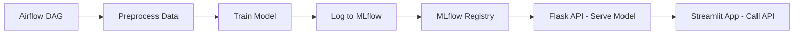

# 🌀 Churn Prediction ML Pipeline with Airflow, MLflow, Docker & Streamlit

This project is an end-to-end Machine Learning pipeline for predicting customer churn using a RandomForest/Logistic Regression model. It integrates various tools such as Apache Airflow for orchestration, MLflow for model tracking and registry, Flask for API service, and Streamlit for interactive web UI — all containerized using Docker.

---

## 📌 Objectives

- Build a reproducible ML workflow from data preprocessing to deployment.
- Enable experiment tracking and model versioning using MLflow.
- Serve a trained model via a Flask API.
- Provide an intuitive interface for business users using Streamlit.
- Automate training and evaluation using Airflow DAGs.
- Containerize the full pipeline using Docker.

---

## 🧱 Tools & Technologies Used

| Tool          | Purpose |
|---------------|---------|
| **Airflow**   | Orchestrates preprocessing, training, and model logging |
| **MLflow**    | Tracks experiments, logs metrics, and serves the model |
| **Flask API** | Serves the trained ML model as a prediction service |
| **Streamlit** | Offers a UI to interact with the churn prediction model |
| **Docker**    | Containerizes all components and services |
| **Sklearn**   | Trains the classification model |
| **Pandas**    | Handles data manipulation and CSV IO |

---

## 📊 Architecture



---

## ⚙️ Pipeline Components

### 1. **Airflow**
- Runs `preprocess.py` and `train.py` in sequence.
- Saves cleaned data and encoders to the `dags/` folder.

### 2. **MLflow**
- Logs metrics, parameters, model artifacts.
- Uses `mlruns` as backend store and artifact root.
- Provides a UI on `http://localhost:5001`.

### 3. **Flask API**
- Loads latest model from MLflow.
- Accepts POST requests with JSON input.
- Applies label encoders and outputs predictions.

### 4. **Streamlit**
- Collects user inputs through dropdowns and sliders.
- Sends data to Flask API and shows prediction.
- Optionally displays confidence levels via bar chart.

---

## 🚀 Getting Started

```bash
# Clone the repo
git clone https://github.com/your-username/churn-prediction-dockerized
cd churn-prediction-dockerized

# Start all services
docker-compose up --build
```

Once up:
- 📋 Airflow: [localhost:8090](http://localhost:8090)
- 📈 MLflow: [localhost:5001](http://localhost:5001)
- 🧠 Flask API: [localhost:5055](http://localhost:5055)
- 🖼️ Streamlit: [localhost:8501](http://localhost:8501)

---

## 🧪 Challenges Faced

- MLflow permission issues when writing to `mlruns` directory.
- Docker network misconfigurations breaking Flask API connections.
- Volume mount inconsistencies across containers.
- Schema mismatch between encoded input and model signature.

---

## ✅ Achievements

- Fully automated and reproducible ML pipeline.
- Seamless experiment tracking and model registry.
- Real-time prediction API integrated with modern UI.
- End-to-end deployment using only Docker containers.
- Easy collaboration and visibility through centralized MLflow tracking.

---

## 🧼 Cleanup

```bash
docker-compose down -v --remove-orphans
```

---

## 🧠 Future Improvements

- Add unit tests for preprocessing and API routes.
- Implement model CI/CD with GitHub Actions.
- Auto-refresh Streamlit after model update.

---
I can enhance the churn prediction project with AI-powered features to make it more dynamic, insightful, and actionable. Here are several AI product ideas I can incorporate:

## ✅ 1. Explainable AI (XAI)
Tool: SHAP, LIME
Purpose: Help business users understand why a customer is predicted to churn.

🔹 Integrate SHAP visualizations in Streamlit to show:

Feature importance per customer

Global vs. local explanations

## ✅ 2. Churn Risk Segmentation
Tool: Clustering (e.g., K-Means) or Decision Trees
Purpose: Group users into different churn risk segments and recommend retention strategies.

🔹 Output risk scores and segment labels:

High-risk: immediate retention offers

Medium-risk: send survey

Low-risk: standard engagement

## ✅ 3. Natural Language Processing (NLP) for Feedback Analysis
Tool: HuggingFace Transformers, spaCy
Purpose: Analyze open-ended customer feedback or support tickets.

🔹 Classify feedback as: complaint, praise, suggestion
🔹 Perform sentiment analysis and integrate it as a feature in the churn model

## ✅ 4. Conversational AI
Tool: Rasa, Dialogflow
Purpose: Deploy a chatbot that:

Answers customer queries

Proactively alerts users when churn risk is high

Offers retention discounts

## ✅ 5. Recommendation Engine
Tool: Collaborative Filtering or Content-Based Models
Purpose: Recommend personalized offers or products to reduce churn.

🔹 E.g., if user is about to churn, recommend:

A discount

A plan upgrade

A feature most liked by similar users

## ✅ 6. Real-Time Prediction via Kafka + AI Model
Tool: Kafka + Spark ML + MLflow
Purpose: Predict churn in real-time as user activity is logged (streamed events).

🔹 Event-based inference → push results to:

Streamlit dashboard

CRM

Notification system

## ✅ 7. AutoML for Model Selection
Tool: H2O AutoML, Amazon SageMaker Autopilot
Purpose: Automatically tune and deploy the best-performing churn model.

How to Integrate into Your Project
Component	Integration Plan
Streamlit UI	Add SHAP plots, churn score gauges, and feedback entry
Flask API	Accept real-time feedback text for sentiment/churn scoring
Airflow	Add DAG to retrain model periodically using feedback or new data
Docker	Containerize SHAP server, NLP services, and chatbot for deployment
MLflow	Track performance of different AI-enhanced models
Database or Redis	Store real-time churn predictions for action tracking

Adding a recommendation engine to your churn prediction project is a smart move—it enhances personalization and adds tangible business value. Here's how we can proceed step-by-step:

## 🔍 Step 1: Define the Purpose
What kind of recommendation engine do you want?

Next Best Offer/Product: Suggest products or services to users likely to churn.

Retention Strategy: Recommend engagement or retention tactics.

General Upsell: Offer complementary services/products to existing users.

## 🧩 Step 2: Choose the Type of Recommendation Engine
There are three main types:

Content-Based Filtering:

Based on user preferences and item features.

Example: Recommending similar plans based on past usage.

Collaborative Filtering:

Based on similar users' behaviors.

Example: “Users like you who churned also liked…”

Hybrid:

Combines both methods.

Often most effective for personalized retention strategies.

## 🛠️ Step 3: Tools & Stack
We'll integrate this with your existing stack:

Component	Tool/Tech
Data Pipeline	Airflow
Model Tracking	MLflow
API Service	Flask
Frontend	Streamlit
Environment	Docker

For the engine, we can use:

Surprise, LightFM, or Scikit-learn for model

Pandas/Numpy for feature engineering

MLflow to track the recommendation model as well

## 📦 Step 4: Dataset Requirements
User IDs

Product/Service IDs

User behavior (purchase, usage, ratings, feedback)

Labels (e.g., churn flag, satisfaction scores)

We’ll need to augment your current dataset with this if not already available.

## 🚀 Step 5: Output and API Integration
Expose /recommend endpoint in your Flask API.

Display recommended items in your Streamlit dashboard for the user being analyzed.
## 📝 License

Lapel License
