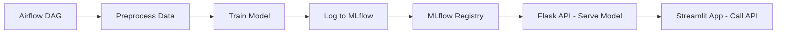

# proj_ml_churn
# 🌀 Churn Prediction ML Pipeline with Airflow, MLflow, Docker & Streamlit

This project is an end-to-end Machine Learning pipeline for predicting customer churn using a RandomForest model. It integrates various tools such as Apache Airflow for orchestration, MLflow for model tracking and registry, Flask for API service, and Streamlit for interactive web UI — all containerized using Docker.

---

## 📌 Objectives

- Build a reproducible ML workflow from data preprocessing to deployment.
- Enable experiment tracking and model versioning using MLflow.
- Serve a trained model via a Flask API.
- Provide an intuitive interface for business users using Streamlit.
- Automate training and evaluation using Airflow DAGs.
- Containerize the full pipeline using Docker.

---

## 🧱 Tools & Technologies Used

| Tool          | Purpose |
|---------------|---------|
| **Airflow**   | Orchestrates preprocessing, training, and model logging |
| **MLflow**    | Tracks experiments, logs metrics, and serves the model |
| **Flask API** | Serves the trained ML model as a prediction service |
| **Streamlit** | Offers a UI to interact with the churn prediction model |
| **Docker**    | Containerizes all components and services |
| **Sklearn**   | Trains the classification model |
| **Pandas**    | Handles data manipulation and CSV IO |

---

## 📊 Architecture



---

## ⚙️ Pipeline Components

### 1. **Airflow**
- Runs `preprocess.py` and `train.py` in sequence.
- Saves cleaned data and encoders to the `dags/` folder.

### 2. **MLflow**
- Logs metrics, parameters, model artifacts.
- Uses `mlruns` as backend store and artifact root.
- Provides a UI on `http://localhost:5001`.

### 3. **Flask API**
- Loads latest model from MLflow.
- Accepts POST requests with JSON input.
- Applies label encoders and outputs predictions.

### 4. **Streamlit**
- Collects user inputs through dropdowns and sliders.
- Sends data to Flask API and shows prediction.
- Optionally displays confidence levels via bar chart.

---

## 🚀 Getting Started

```bash
# Clone the repo
git clone https://github.com/your-username/churn-prediction-dockerized
cd churn-prediction-dockerized

# Start all services
docker-compose up --build
```

Once up:
- 📋 Airflow: [localhost:8090](http://localhost:8090)
- 📈 MLflow: [localhost:5001](http://localhost:5001)
- 🧠 Flask API: [localhost:5002](http://localhost:5002)
- 🖼️ Streamlit: [localhost:8501](http://localhost:8501)

---

## 🧪 Challenges Faced

- MLflow permission issues when writing to `mlruns` directory.
- Docker network misconfigurations breaking Flask API connections.
- Volume mount inconsistencies across containers.
- Schema mismatch between encoded input and model signature.

---

## ✅ Achievements

- Fully automated and reproducible ML pipeline.
- Seamless experiment tracking and model registry.
- Real-time prediction API integrated with modern UI.
- End-to-end deployment using only Docker containers.
- Easy collaboration and visibility through centralized MLflow tracking.

---

## 🧼 Cleanup

```bash
docker-compose down -v --remove-orphans
```

---

## 🧠 Future Improvements

- Add unit tests for preprocessing and API routes.
- Implement model CI/CD with GitHub Actions.
- Auto-refresh Streamlit after model update.

---

## 📝 License

Lapel License
